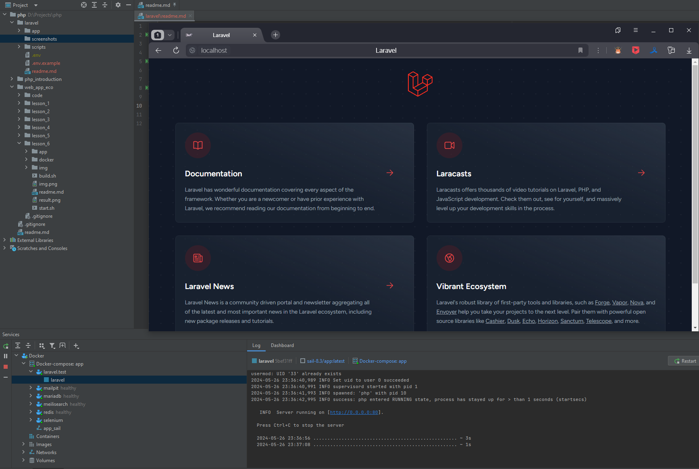
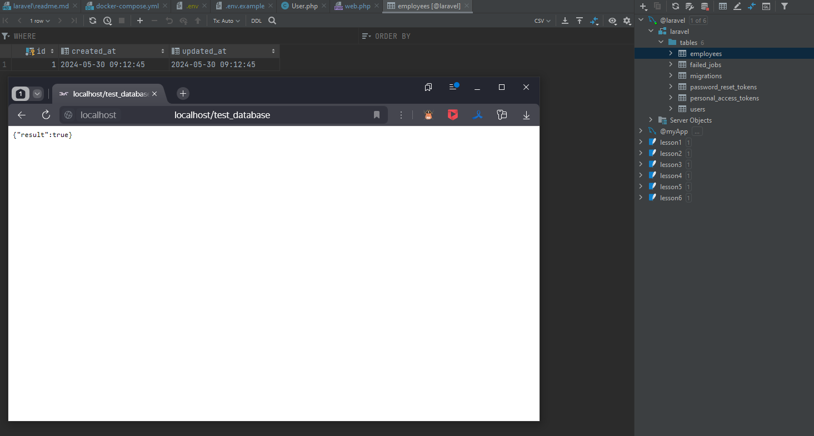

### DockerRun
```sh
sh scripts/build.sh && exit # Сборка проекта
```
```sh
sh scripts/start.sh && exit # Запуск проекта
```
```sh
sh scripts/stop.sh && exit # Остановка проекта
```
<details class="block"><summary>Docker mirrors</summary>

- Добавить зеркала для Docker (Windows: `%USERNAME%\.docker\daemon.json`)
```text
"registry-mirrors": [
    "https://huecker.io",
    "https://dockerhub.timeweb.cloud",
    "https://daocloud.io",
    "https://mirror.gcr.io"
]
```

</details>

### Homeworks
<details class="block"><summary>lesson 1</summary>



</details>
<details class="block"><summary>lesson 2</summary>

[lesson_2 commit](https://github.com/crasher307/php/pull/1/files)

</details>
<details class="block"><summary>lesson 3</summary>


[lesson_3 commit](https://github.com/crasher307/php/pull/2/files)

</details>
<details class="block"><summary>lesson 4</summary>

[lesson_4 commit](https://github.com/crasher307/php/pull/3/files)

</details>
<details class="block"><summary>lesson 5</summary>

[lesson_5 commit](https://github.com/crasher307/php/pull/4/files)

</details>
<details class="block"><summary>lesson 6</summary>

[lesson_6 commit](https://github.com/crasher307/php/pull/5/files)

</details>
<details class="block"><summary>lesson 7</summary>

[lesson_7 commit](https://github.com/crasher307/php/pull/6/files)

</details>
<details class="block"><summary>lesson 8</summary>

[lesson_8 commit](https://github.com/crasher307/php/pull/7/files)

</details>
<details class="block"><summary>lesson 9</summary>

[lesson_9 commit](https://github.com/crasher307/php/pull/8/files)

</details>

### <div class="hidden">Other</div>
<details class="block hidden"><summary>Стили для IDE</summary>

<style>
h1, h2, h3, h4, h5, h6 {
    font-weight: 800;
    margin: 0 0 10px;
    padding: 20px 0 10px;
}
.block {
    margin: 0 0 0 1em;
    padding: 0 0 1em;
}
.block > summary {
    margin: 0 0 0 -1em;
    font-weight: bold;
    cursor: pointer;
}
.block pre {
    border-radius: 10px;
    margin: 10px 0;
    padding: 0.8em 1em;
}
.block pre + pre {
    margin: -8px 0 10px;
}
.hidden {
  display: none;
}
</style>

</details>